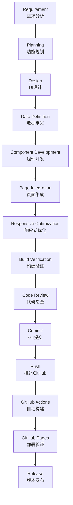

# Development Lifecycle

> Version: v1.0
>
> Last Update: 2026-07
>
> This document describes the complete development lifecycle of the HelloWorld project.

---

# 1. Overview

HelloWorld follows a structured development lifecycle.

Every feature should move through the following stages:

```
Requirement

↓

Planning

↓

Design

↓

Data Definition

↓

Component Development

↓

Page Integration

↓

Responsive Optimization

↓

Build Verification

↓

Code Review

↓

Commit

↓

Deployment

↓

Release
```

The purpose is to ensure:

- Consistency
- Quality
- Maintainability
- Scalability

---

# 2. Complete Lifecycle Diagram



---

# 3. Lifecycle Stages

---

# Stage 1: Requirement

## Purpose

明确需要开发什么。

Examples:

```
Add Stats Section

Upgrade Hero Animation

Create About Section
```

需要确认：

- 功能目标
- 用户价值
- 是否符合 Roadmap

参考：

```
docs/ROADMAP.md
```

---

# Stage 2: Planning

## Purpose

确定实现方案。

需要考虑：

- 是否需要新组件
- 是否需要新增数据
- 是否需要修改已有结构

例如：

Stats:

```
constants/stats.ts

↓

components/home/Stats.tsx

↓

app/page.tsx
```

---

# Stage 3: Design

## Purpose

确定 UI 设计。

遵循：

```
docs/UI_GUIDELINES.md
```

检查：

- Color
- Typography
- Spacing
- Layout
- Animation

---

# Stage 4: Data Definition

## Purpose

数据和 UI 分离。

静态数据放：

```
constants/
```

Example:

```
constants/features.ts
```

不要：

```tsx
const features = [
...
]
```

直接写在组件内部。

---

# Stage 5: Component Development

## Purpose

创建独立组件。

位置：

```
components/
```

例如：

```
components/home/Stats.tsx
```

原则：

- 单一职责
- 可复用
- 清晰命名
- 不包含业务配置

---

# Stage 6: Page Integration

## Purpose

将组件加入页面。

入口：

```
app/page.tsx
```

Example:

```tsx
<Navbar />

<Hero />

<Stats />

<Features />

<Footer />
```

保持页面结构清晰。

---

# Stage 7: Responsive Optimization

## Purpose

确保所有设备正常显示。

必须检查：

## Mobile

```
<768px
```

## Tablet

```
768px - 1024px
```

## Desktop

```
>1024px
```

检查：

- Layout
- Font Size
- Image
- Button
- Spacing

---

# Stage 8: Build Verification

## Purpose

确保代码可以生产构建。

执行：

```bash
npm run build
```

必须通过：

- TypeScript
- Next.js Build
- Static Export

---

# Stage 9: Code Review

检查：

## Architecture

- 是否符合目录结构
- 是否重复代码

---

## Code Quality

- 是否使用 TypeScript
- 是否避免 any
- 是否组件合理

---

## UI

- 是否符合设计规范
- 是否响应式

---

## Deployment

- 是否支持 GitHub Pages
- 图片路径是否正确

---

# Stage 10: Git Commit

提交代码。

格式：

```
type: description
```

Examples:

```
feat: add stats section

fix: resolve image path issue

style: improve hero layout

docs: update development lifecycle
```

---

# Stage 11: Push

推送：

```bash
git push
```

触发：

```
GitHub Actions
```

---

# Stage 12: CI/CD

自动流程：

```
GitHub Push

↓

GitHub Actions

↓

npm install

↓

npm run build

↓

Static Export

↓

Deploy
```

---

# Stage 13: Deployment Verification

检查：

- 页面是否打开
- 图片是否正常
- 路由是否正常
- 移动端是否正常

访问：

```
GitHub Pages URL
```

---

# Stage 14: Release

完成后：

更新：

```
CHANGELOG.md
```

记录：

- Added
- Changed
- Fixed

---

# 4. Feature Development Checklist

每个新功能：

## Planning

- [ ] Feature defined
- [ ] Roadmap checked
- [ ] Architecture decided

---

## Development

- [ ] Constants created
- [ ] Component created
- [ ] Page integrated
- [ ] Responsive completed

---

## Verification

- [ ] npm run build passed
- [ ] GitHub Pages verified
- [ ] Documentation updated

---

## Release

- [ ] CHANGELOG updated
- [ ] Git commit created
- [ ] Git pushed

---

# 5. Hotfix Lifecycle

紧急 Bug 修复：

```
Issue Found

↓

Create Fix Branch

↓

Implement Fix

↓

Build Test

↓

Commit

↓

Deploy

↓

Update CHANGELOG
```

Example:

```
fix/image-path-error
```

---

# 6. Documentation Lifecycle

文档也是项目的一部分。

修改：

Architecture

↓

更新：

```
PROJECT_SPEC.md
```

---

UI 修改

↓

更新：

```
UI_GUIDELINES.md
```

---

Development 修改

↓

更新：

```
DEVELOPMENT.md
```

---

版本变化

↓

更新：

```
CHANGELOG.md
```

---

# 7. AI Assisted Development Lifecycle

AI 参与开发时：

必须遵循：

```
Read Documentation

↓

Understand Architecture

↓

Plan Solution

↓

Implement

↓

Verify

↓

Update Documentation
```

AI 首先阅读：

```
README.md

docs/PROJECT_SPEC.md

docs/UI_GUIDELINES.md

docs/ROADMAP.md

docs/AI_CONTEXT.md
```

---

# 8. Core Principle

The HelloWorld development lifecycle follows:

> Plan carefully.
>
> Build modularly.
>
> Verify continuously.
>
> Document everything.
>
> Deploy confidently.

---

# Final Goal

建立一个：

- 可持续开发
- 可维护
- 可扩展
- AI 友好

的现代 Web 项目开发流程。