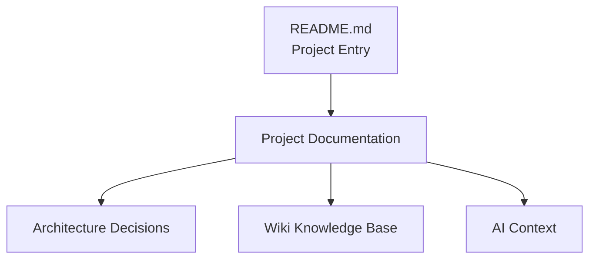

# ADR-0006: Documentation System Strategy

Date:

2026-07

Status:

Accepted

---

# Context

As HelloWorld evolves, the project contains more than source code.

The project now includes:

- Application code
- UI design rules
- Architecture decisions
- Development workflow
- Deployment knowledge
- AI collaboration context
- Wiki knowledge base

Without a structured documentation system:

- Knowledge becomes scattered
- New contributors need more onboarding time
- Architectural decisions may be lost
- AI assistants cannot understand project history
- Future maintenance becomes difficult

Therefore, a dedicated documentation architecture is required.

---

# Decision

HelloWorld adopts a structured documentation system.

The documentation system consists of:

```
README.md

+

docs/

+

Wiki

+

ADR

+

AI Context
```

---

# Documentation Architecture



---

# Documentation Layers

## Layer 1: Project Entry

File:

```
README.md
```

Purpose:

Provide a quick project overview.

Contains:

- Project introduction
- Installation
- Usage
- Deployment
- Documentation links

Audience:

- Visitors
- Developers
- Contributors

---

# Layer 2: Core Documentation

Location:

```
docs/
```

Purpose:

Maintain project knowledge.

Structure:

```
docs/

├── PROJECT_SPEC.md

├── UI_GUIDELINES.md

├── ROADMAP.md

├── DEVELOPMENT.md

├── CONTRIBUTING.md

├── CHANGELOG.md

└── AI_CONTEXT.md
```

---

# Layer 3: Architecture Decision Records

Location:

```
docs/decisions/
```

Purpose:

Record important technical decisions.

Examples:

```
0001-github-pages-base-path.md

0002-project-structure.md

0003-component-architecture.md

0004-design-system.md

0005-github-actions-deployment.md
```

ADR answers:

- What was decided?
- Why was it decided?
- What alternatives existed?
- What are the consequences?

---

# Layer 4: Wiki Knowledge Base

Location:

Future:

```
docs/wiki/
```

Purpose:

Provide deeper knowledge.

Topics:

- Tutorials
- Component usage
- Development guides
- Troubleshooting
- Architecture explanation

Future implementation:

```
Markdown

↓

MDX

↓

Next.js Wiki UI
```

---

# Layer 5: AI Context

File:

```
docs/AI_CONTEXT.md
```

Purpose:

Help AI assistants understand:

- Project goals
- Architecture
- Coding conventions
- Current progress

Before major AI-assisted development:

AI should review:

```
README.md

PROJECT_SPEC.md

UI_GUIDELINES.md

ROADMAP.md

AI_CONTEXT.md
```

---

# Documentation Principles

## Single Source of Truth

Each type of information should have one primary location.

Example:

Architecture decision:

```
docs/decisions/
```

not scattered in code comments.

---

## Documentation Near Code

Important knowledge should stay close to the project.

Avoid:

- External private documents
- Personal notes only
- Untracked knowledge

---

## Version Controlled

Documentation changes must be committed with code.

Example:

```
feat: add stats component

docs: update component documentation
```

---

## Living Documentation

Documentation should evolve with the project.

When code changes:

Check whether documents need updates.

---

# Documentation Workflow

When adding a new feature:

```
Feature Idea

↓

Update ROADMAP

↓

Design Component

↓

Implement Code

↓

Update Documentation

↓

Update CHANGELOG

↓

Commit
```

---

# Documentation Naming Rules

Use:

```
UPPERCASE.md
```

for major documents.

Examples:

```
README.md

ROADMAP.md

CHANGELOG.md
```

---

Use:

```
lowercase-kebab-case.md
```

for ADR and Wiki.

Examples:

```
0001-github-pages-base-path.md

component-development.md
```

---

# Alternatives Considered

## No Documentation System

Rejected.

Reasons:

- Knowledge loss
- Hard onboarding
- Difficult AI collaboration

---

## External Documentation Platform

Examples:

- Notion
- Google Docs
- Confluence

Rejected for now.

Reasons:

- Knowledge separated from code
- Harder version control
- Less suitable for open-source workflow

---

## Only README.md

Rejected.

Reasons:

- Too much content
- Poor organization
- Difficult maintenance

---

# Consequences

## Positive

- Better project understanding
- Faster onboarding
- Better AI collaboration
- Easier maintenance
- Clear architectural history

---

## Negative

- Requires maintenance effort
- Documentation becomes part of development responsibility

---

# Future Evolution

The documentation system may evolve into:

```
Markdown

↓

MDX Documentation Site

↓

Search Engine

↓

AI Knowledge Assistant
```

---

# Related Documents

```
README.md

AI_CONTEXT.md

WIKI_GUIDELINES.md

WIKI_STRUCTURE.md

DEVELOPMENT.md
```

---

# Final Principle

> Code builds the product.
>
> Documentation preserves the knowledge.
>
> Together they build a sustainable engineering system.